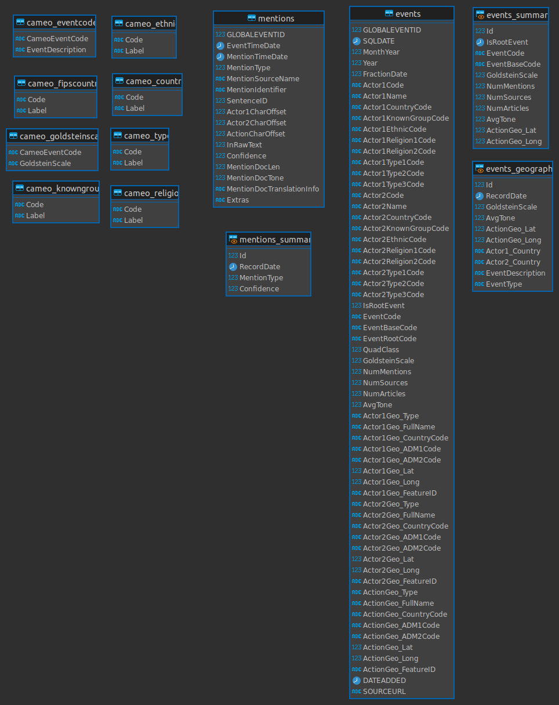

# Clickhouse Database

- Clickhouse is used as Database
- Data is partitioned on Year and Month
- Also Ordered on Creation
- LowCardinality is a data type used to save dictionary type values (unique entries less than 10k) to optimize performance and disk usage

### Following is the ER Diagram

